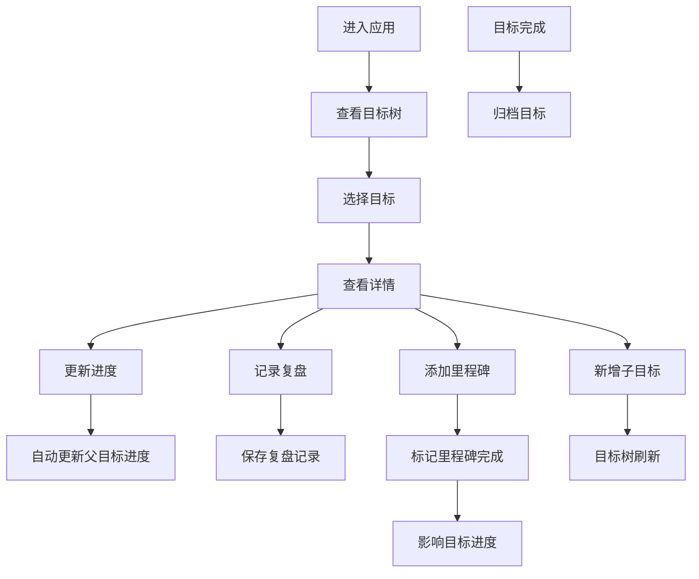

# 目标分解工具 - 产品需求文档（PRD）

## 1. 产品概述
目标分解工具是一款帮助用户将大目标拆解为子目标和具体动作的个人效率管理应用。通过树形结构可视化目标层级，跟踪进度百分比，管理里程碑，记录复盘内容，实现目标的高效管理与达成。

- **主要用途**：个人目标管理、项目进度跟踪、学习计划制定
- **解决问题**：大目标难以落地、进度不透明、缺乏复盘机制
- **目标用户**：职场人士、学生、自由职业者等需要管理长期目标的人群
- **产品价值**：让目标可量化、可跟踪、可复盘，提升目标达成率

## 2. 核心功能

### 2.1 用户角色
| 角色 | 注册方式 | 核心权限 |
|------|----------|----------|
| 普通用户 | 无需注册（本地使用） | 目标增删改查、进度管理、里程碑管理、复盘记录、目标归档 |

### 2.2 功能模块
1. **目标树页面**：树形结构展示目标层级、进度可视化、快速操作按钮
2. **目标详情页面**：目标基本信息、子目标列表、里程碑管理、进度历史
3. **复盘页面**：复盘记录列表、复盘详情、进度变更记录
4. **归档页面**：已归档目标查看、恢复/删除操作

### 2.3 页面详情
| 页面名称 | 模块名称 | 功能描述 |
|---------|----------|----------|
| 目标树页面 | 目标树形展示 | 支持展开/收起、显示进度条、颜色区分状态 |
| 目标树页面 | 目标操作栏 | 新增子目标、编辑、删除、归档、调整进度 |
| 目标树页面 | 统计卡片 | 总目标数、进行中、已完成、已归档数量统计 |
| 目标详情页面 | 基本信息 | 标题、描述、优先级、起止日期、状态展示 |
| 目标详情页面 | 里程碑管理 | 新增、编辑、删除、标记完成里程碑 |
| 目标详情页面 | 进度历史 | 进度变更时间线、变更原因展示 |
| 复盘页面 | 复盘列表 | 按时间倒序展示复盘记录、关联目标信息 |
| 复盘页面 | 复盘详情 | 复盘内容、问题、解决方案、下一步计划 |
| 归档页面 | 归档列表 | 已归档目标展示、恢复、永久删除 |

## 3. 核心流程

### 3.1 用户主流程
用户进入应用 → 查看目标树 → 点击目标查看详情 → 新增子目标/更新进度 → 定期记录复盘 → 完成后归档目标

### 3.2 流程图

## 4. 用户界面设计

### 4.1 设计风格
- **主色调**：深蓝渐变（#1e3a8a → #3b82f6），代表专业与可信赖
- **辅助色**：
  - 进行中：绿色（#10b981）
  - 已完成：蓝色（#3b82f6）
  - 高优先级：红色（#ef4444）
  - 中优先级：橙色（#f59e0b）
  - 低优先级：灰色（#6b7280）
- **按钮风格**：圆角 8px，悬停有轻微上浮效果，点击有按压反馈
- **字体**：PingFang SC / Microsoft YaHei，标题加粗，正文常规
- **布局风格**：左侧导航栏 + 右侧内容区，卡片式布局，层次分明
- **图标风格**：使用 Element Plus 图标库，线性风格，统一 20px 尺寸

### 4.2 页面设计概述
| 页面名称 | 模块名称 | UI 元素 |
|---------|----------|----------|
| 目标树页面 | 统计卡片 | 渐变背景、大数字展示、图标装饰 |
| 目标树页面 | 树形结构 | 缩进层级、连接线、进度条、状态标签 |
| 目标详情页面 | 信息卡片 | 网格布局、标签分组、时间线 |
| 复盘页面 | 复盘列表 | 时间线布局、关联目标标签 |

### 4.3 响应式设计
- **桌面优先**：1200px 以上最佳体验
- **平板适配**：1024px 时导航栏收起为图标模式
- **移动适配**：768px 以下底部导航，内容单列布局

## 5. 交互设计
- 目标树支持拖拽排序
- 进度条支持点击拖动调整
- 新增/编辑使用侧边抽屉或弹窗
- 页面切换使用淡入淡出过渡
- 数据加载使用骨架屏占位
