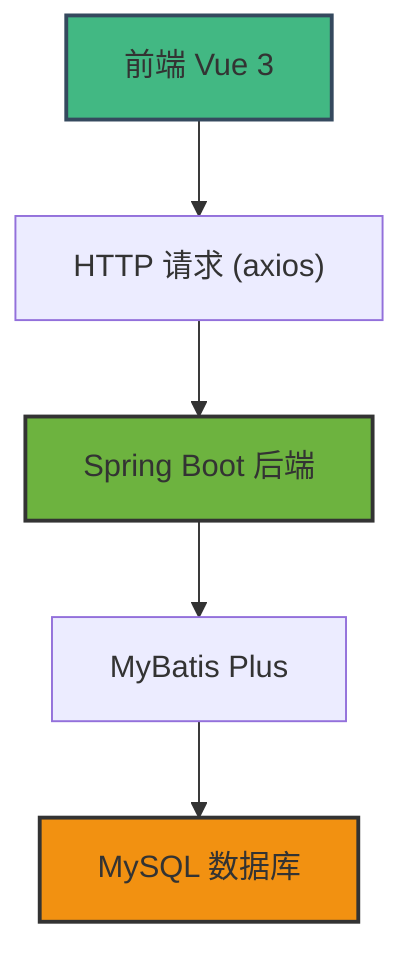
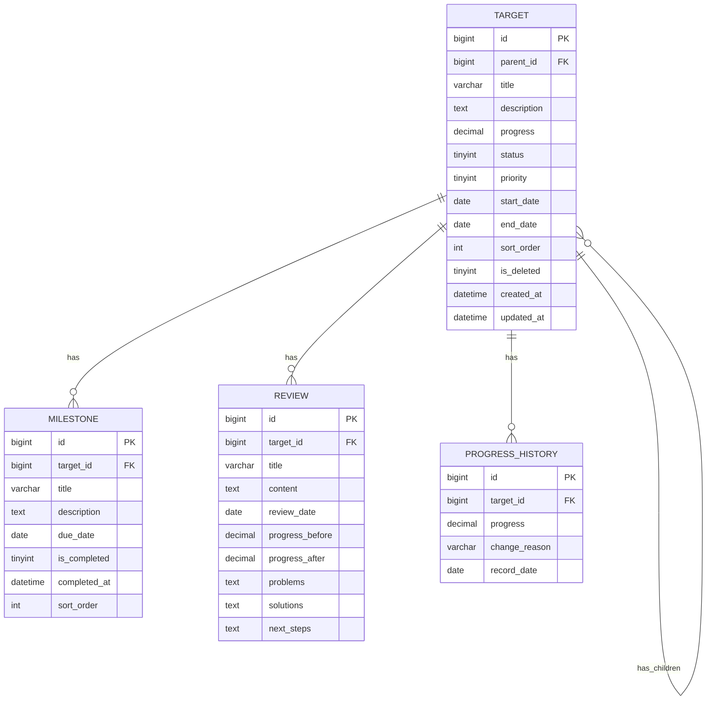

# 目标分解工具 - 技术架构文档

## 1. 架构设计



## 2. 技术描述

### 2.1 前端技术栈
- **框架**: Vue 3 + Composition API
- **构建工具**: Vite 5.x
- **UI 组件库**: Element Plus 2.x
- **路由**: Vue Router 4.x
- **HTTP 客户端**: Axios
- **状态管理**: Pinia
- **图标**: @element-plus/icons-vue

### 2.2 后端技术栈（已存在）
- **框架**: Spring Boot 2.7.18
- **ORM**: MyBatis Plus 3.5.3.1
- **数据库**: MySQL 5.7.26
- **端口**: 8081

## 3. 目录结构

```
frontend/
├── public/
├── src/
│   ├── api/              # API 接口定义
│   │   └── target.js
│   ├── assets/           # 静态资源
│   ├── components/       # 公共组件
│   │   ├── TargetTree.vue
│   │   └── ProgressBar.vue
│   ├── router/           # 路由配置
│   │   └── index.js
│   ├── stores/           # Pinia 状态管理
│   ├── utils/            # 工具函数
│   │   └── request.js
│   ├── views/            # 页面组件
│   │   ├── TargetTree.vue
│   │   ├── TargetDetail.vue
│   │   ├── ReviewList.vue
│   │   └── ArchiveList.vue
│   ├── App.vue
│   └── main.js
├── index.html
├── package.json
└── vite.config.js
```

## 4. 路由定义

| 路由路径 | 页面名称 | 说明 |
|---------|---------|------|
| `/` | 目标树页面 | 默认首页，展示目标树形结构 |
| `/target/:id` | 目标详情页 | 展示单个目标的详细信息 |
| `/review` | 复盘列表页 | 展示所有复盘记录 |
| `/archive` | 归档列表页 | 展示已归档的目标 |

## 5. API 定义

### 5.1 目标相关接口

```typescript
// 目标实体
interface Target {
  id: number;
  parentId: number | null;
  title: string;
  description: string;
  progress: number;
  status: number; // 1-进行中 2-已完成 3-已暂停 4-已归档
  priority: number; // 1-高 2-中 3-低
  startDate: string;
  endDate: string;
  sortOrder: number;
  createdAt: string;
  updatedAt: string;
  children?: Target[];
}

// 获取目标列表
GET /api/target/list
Response: { code: 200, data: Target[] }

// 获取目标详情
GET /api/target/{id}
Response: { code: 200, data: Target }

// 新增目标
POST /api/target
Body: { parentId, title, description, priority, startDate, endDate }
Response: { code: 200, data: Target }

// 更新目标
PUT /api/target/{id}
Body: { title, description, progress, status, priority, startDate, endDate }
Response: { code: 200, data: Target }

// 删除目标
DELETE /api/target/{id}
Response: { code: 200, message: 'success' }

// 获取目标树结构
GET /api/target/tree
Response: { code: 200, data: Target[] }
```

### 5.2 里程碑相关接口

```typescript
interface Milestone {
  id: number;
  targetId: number;
  title: string;
  description: string;
  dueDate: string;
  isCompleted: number;
  completedAt: string;
  sortOrder: number;
}

// 获取目标的里程碑列表
GET /api/milestone/list?targetId={targetId}
Response: { code: 200, data: Milestone[] }

// 新增里程碑
POST /api/milestone
Body: { targetId, title, description, dueDate, sortOrder }
Response: { code: 200, data: Milestone }

// 更新里程碑
PUT /api/milestone/{id}
Body: { title, description, dueDate, isCompleted }
Response: { code: 200, data: Milestone }

// 删除里程碑
DELETE /api/milestone/{id}
Response: { code: 200, message: 'success' }
```

### 5.3 复盘相关接口

```typescript
interface Review {
  id: number;
  targetId: number;
  title: string;
  content: string;
  reviewDate: string;
  progressBefore: number;
  progressAfter: number;
  problems: string;
  solutions: string;
  nextSteps: string;
}

// 获取复盘列表
GET /api/review/list
Response: { code: 200, data: Review[] }

// 获取目标的复盘列表
GET /api/review/list?targetId={targetId}
Response: { code: 200, data: Review[] }

// 新增复盘
POST /api/review
Body: { targetId, title, content, reviewDate, progressBefore, progressAfter, problems, solutions, nextSteps }
Response: { code: 200, data: Review }
```

## 6. 数据模型

### 6.1 ER 图



### 6.2 核心数据结构说明

1. **目标表 (target)**：使用 `parent_id` 实现自关联树形结构，配合闭包表 `target_closure` 实现高效的树查询
2. **里程碑表 (milestone)**：每个目标可以有多个里程碑，用于分解目标的关键节点
3. **复盘表 (review)**：记录每次复盘的内容，关联到具体目标
4. **进度历史表 (progress_history)**：记录目标进度的每次变更，用于进度回溯展示

## 7. 前端技术实现要点

### 7.1 树形结构渲染
- 使用递归组件实现目标树的渲染
- 支持无限层级嵌套
- 展开/收起状态本地存储

### 7.2 进度计算
- 叶子目标进度由用户手动设置
- 父目标进度 = 所有子目标进度的平均值
- 进度更新时自动向上递归更新所有父节点

### 7.3 状态管理
- 使用 Pinia 管理目标数据缓存
- API 响应数据统一处理
- 加载状态和错误提示统一管理

### 7.4 开发配置
- Vite 代理配置：`/api` 转发到 `http://localhost:8081`
- 自动导入 Element Plus 组件
- ESLint + Prettier 代码规范
