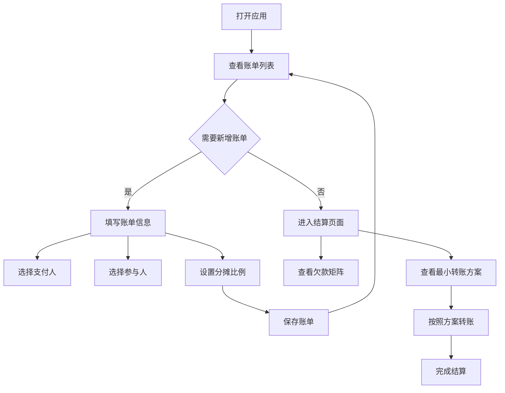

## 1. 产品概述

旅行账单分摊系统是一款用于解决多人旅行时费用分摊问题的Web应用。朋友结伴旅行时，费用垫付情况复杂，多人多笔垫付后人工计算容易出错，本系统通过自动化计算和智能算法，让旅行归来后一键生成最优转账方案。

- 核心价值：解决多人旅行中的费用分摊痛点，自动计算每人欠款金额，提供最小转账次数的结算方案，让朋友间的费用结算简单透明。
- 目标用户：经常结伴旅行的朋友、家庭出游群体、团建活动组织者。

## 2. 核心功能

### 2.1 用户角色
本系统无复杂角色区分，所有用户拥有全部权限。

### 2.2 功能模块

1. **账单管理**：账单列表展示、新增账单、编辑账单、删除账单
2. **参与人管理**：添加/选择参与人
3. **分摊计算**：按比例自动计算每人分摊金额
4. **欠款矩阵**：可视化展示所有人之间的债权债务关系
5. **最小转账方案**：通过贪心算法计算出最少转账次数的结算方案

### 2.3 页面详情

| 页面名称 | 模块名称 | 功能描述 |
|-----------|-------------|---------------------|
| 账单列表页 | 账单列表 | 展示所有账单，支持按日期筛选，每条账单显示标题、金额、支付人、参与人、日期等信息 |
| 账单列表页 | 新增/编辑账单弹窗 | 表单录入账单信息，支持选择支付人、参与人、设置分摊比例 |
| 结算页 | 欠款矩阵 | 以表格形式展示每个人对其他人的欠款金额，正数表示应收，负数表示应付 |
| 结算页 | 最小转账方案 | 展示最优转账方案，列出每笔转账的付款人、收款人、金额 |

## 3. 核心流程

用户打开应用后，首先在账单列表页面查看所有已录入的账单。用户可以添加新的账单，填写账单标题、金额、选择支付人和参与人，设置分摊比例后保存。在结算页面，系统自动计算欠款矩阵，并使用贪心算法生成最小转账方案，用户按照方案进行转账即可完成结算。

## 4. 用户界面设计

### 4.1 设计风格

- **主色调**：深蓝色 (#3B82F6，蓝色系代表信任、专业
- **辅助色**：绿色 (#10B981) 表示应收款项，红色 (#EF4444) 表示应付款项
- **按钮风格**：圆角8px，hover效果，点击反馈
- **字体**：采用现代无衬线字体，标题使用粗体突出
- **布局风格**：卡片式布局，顶部导航栏，内容区左右或上下分栏
- **图标**：使用简洁的线性图标，保持风格统一

### 4.2 页面设计概述

| 页面名称 | 模块名称 | UI元素 |
|-----------|-------------|-------------|
| 账单列表页 | 账单列表 | 顶部导航（账单/结算切换，筛选区，账单卡片列表，悬浮新增按钮 |
| 账单列表页 | 新增账单弹窗 | 表单标签页动画，表单输入框带图标，比例滑块或输入框 |
| 结算页 | 欠款矩阵 | 表格对角线高亮，颜色区分正负金额，悬停显示详情 |
| 结算页 | 最小转账方案 | 步骤条或列表卡片，箭头指示转账方向，金额醒目显示 |

### 4.3 响应式
采用桌面优先设计，适配平板和移动端，内容区在小屏幕自动换行，表格支持横向滚动。

### 4.4 交互细节
- 页面加载时骨架屏动画
- 表单提交loading状态
- 金额数字格式化显示
- 转账方案卡片hover上浮效果
- 弹窗淡入淡出过渡动画
