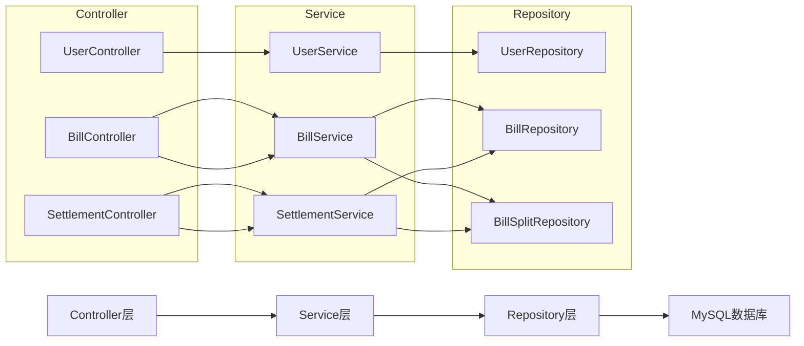
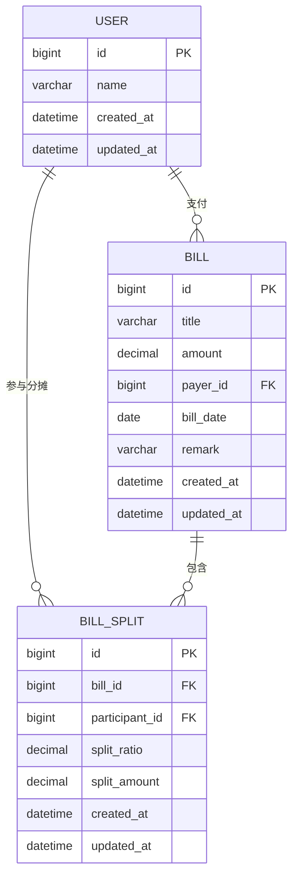

## 1. 架构设计

本系统采用前后端分离架构，前端使用Vue 3构建用户界面，后端使用Spring Boot提供RESTful API服务，数据存储在MySQL数据库中。

```mermaid
flowchart TD
    subgraph "前端"
        A["Vue 3 + Vite"] --> B["Element Plus UI组件"]
        A --> C["Axios HTTP客户端"]
        A --> D["Vue Router路由"]
    end
    
    subgraph "后端"
        E["Spring Boot 2.7.x"] --> F["Spring MVC Controller层"]
        F --> G["业务逻辑Service层"]
        G --> H["Spring Data JPA Repository层"]
    end
    
    subgraph "数据层"
        H --> I["MySQL 5.7+"]
    end
    
    A -->|HTTP请求| F
```



## 2. 技术描述

- **前端技术栈**：Vue 3.4 + Vue Router 4.2 + Element Plus 2.4 + Axios 1.6 + Vite 5.0
- **初始化工具**：Vite
- **后端技术栈**：Spring Boot 2.7.18 + Spring Data JPA + MySQL Connector Java 8.x
- **数据库**：MySQL 5.7+，数据库名 `travel_expense`
- **构建工具**：Maven 3.6+
- **Java版本**：JDK 1.8

## 3. 路由定义

| 路由路径 | 页面名称 | 功能描述 |
|----------|----------|----------|
| / | 首页（账单列表） | 默认路由，展示账单列表 |
| /bills | 账单列表页 | 账单的增删改查操作 |
| /settlement | 结算页 | 展示欠款矩阵和最小转账方案 |

## 4. API 接口定义

### 4.1 用户管理接口

| HTTP方法 | 路径 | 功能描述 |
|---------|------|----------|
| GET | /api/users | 获取所有用户列表 |
| GET | /api/users/{id} | 根据ID获取用户详情 |
| POST | /api/users | 新增用户 |
| PUT | /api/users/{id} | 更新用户信息 |
| DELETE | /api/users/{id} | 删除用户 |

### 4.2 账单管理接口

| HTTP方法 | 路径 | 功能描述 |
|---------|------|----------|
| GET | /api/bills | 获取所有账单列表（包含分摊信息） |
| GET | /api/bills/{id} | 根据ID获取账单详情 |
| POST | /api/bills | 新增账单（包含分摊记录） |
| PUT | /api/bills/{id} | 更新账单信息 |
| DELETE | /api/bills/{id} | 删除账单 |

### 4.3 结算接口

| HTTP方法 | 路径 | 功能描述 |
|---------|------|----------|
| GET | /api/settlement/debt-matrix | 获取欠款矩阵数据 |
| GET | /api/settlement/transfer-plan | 获取最小转账方案 |

### 4.4 数据传输对象

```typescript
// 用户
interface User {
  id: number;
  name: string;
  createdAt: string;
  updatedAt: string;
}

// 账单分摊
interface BillSplit {
  id?: number;
  participantId: number;
  participantName?: string;
  splitRatio: number;
  splitAmount: number;
}

// 账单
interface Bill {
  id?: number;
  title: string;
  amount: number;
  payerId: number;
  payerName?: string;
  billDate: string;
  remark?: string;
  splits: BillSplit[];
  createdAt?: string;
  updatedAt?: string;
}

// 欠款矩阵
interface DebtMatrix {
  users: User[];
  matrix: number[][];  // matrix[i][j] 表示用户i欠用户j的金额
}

// 转账记录
interface Transfer {
  fromUserId: number;
  fromUserName: string;
  toUserId: number;
  toUserName: string;
  amount: number;
}

// 转账方案
interface TransferPlan {
  totalTransfers: number;
  transfers: Transfer[];
}
```

## 5. 后端服务架构



## 6. 数据模型

### 6.1 实体关系图



### 6.2 最小转账算法说明

**算法原理**：

1. 计算每个人的净余额（总收入 - 总支出）
2. 正数表示应收金额，负数表示应付金额
3. 使用贪心算法，每次找出最大的债权人和最大的债务人进行匹配转账
4. 转移金额为两者中的较小值，将转账记录加入方案
5. 更新余额，重复直到所有余额为0

**算法复杂度**：O(n log n)，其中n为参与人数

**核心逻辑**：
```
1. 计算所有用户的净余额
2. 将用户分为债权人（余额>0）和债务人（余额<0）两组
3. 使用两个指针分别指向最大的债权人和最大的债务人
4. 每次匹配转账后移除已清零的用户
5. 直到所有用户余额为0
```
